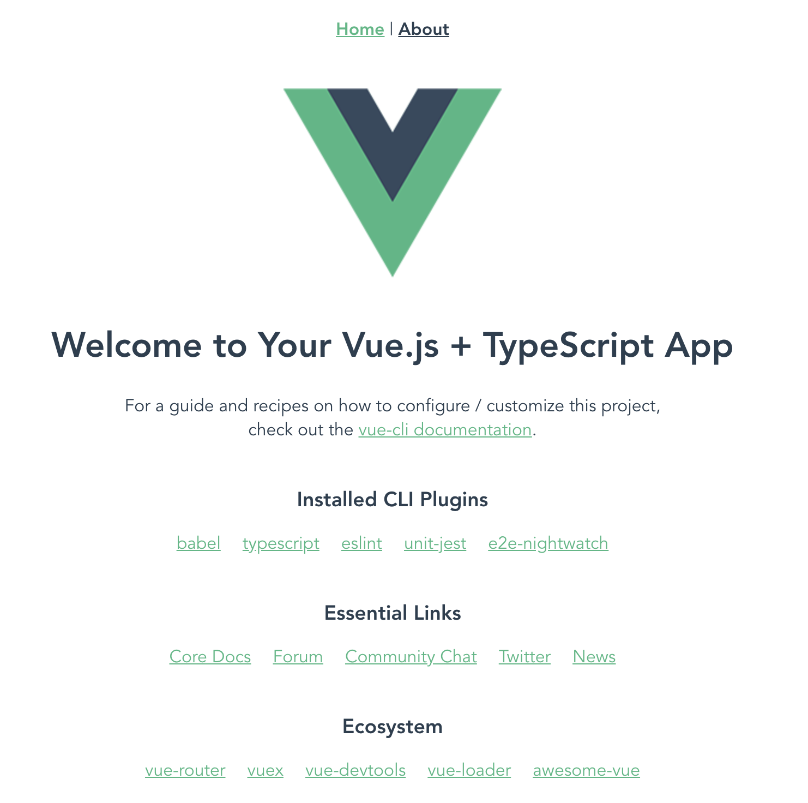
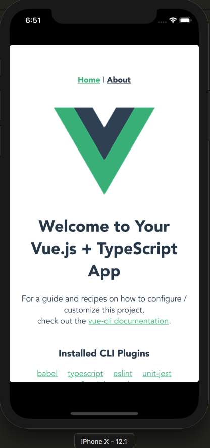

# PhoneGap + Vue + TypeScript 構築ログ

## Requirements

- Node.js 10+
- XCode 3.X (iOS を利用する場合)
- Android Studio 3.X (Android を利用する場合)

> `phonegap` コマンドを利用すると `npm` コマンドが実行されて `package-lock.json` が生成されるため、`yarn` は使わないほうがいい。

## 構築ログ

### Vue プロジェクト作成

```bash
npm install --global @vue/cli
vue create phonegap-vue-examples
```

`PWA` 以外をすべて選択、`Vue-Router` の `history` モードは無効に。あとはお好みで。

```console
Vue CLI v3.11.0
? Please pick a preset: Manually select features
? Check the features needed for your project: Babel, TS, Router, Vuex, CSS Pre-processors, Linter, Unit, E2E
? Use class-style component syntax? Yes
? Use Babel alongside TypeScript (required for modern mode, auto-detected polyfills, transpiling JSX)? Yes
? Use history mode for router? (Requires proper server setup for index fallback in production) No
? Pick a CSS pre-processor (PostCSS, Autoprefixer and CSS Modules are supported by default): Sass/SCSS (with node-sass)
? Pick a linter / formatter config: Prettier
? Pick additional lint features: Lint on save, Lint and fix on commit
? Pick a unit testing solution: Jest
? Pick a E2E testing solution: Nightwatch
? Where do you prefer placing config for Babel, PostCSS, ESLint, etc.? In dedicated config files
? Save this as a preset for future projects? Yes
? Save preset as: phonegap-vue-examples
```

### Vue 動作確認

```bash
cd phonegap-vue-examples
npm run serve
```

ブラウザで http://localhost:8080/ にアクセス。


### PhoneGap プロジェクト作成

`PhoneGap CLI` でひな形を作成し、内容をプロジェクトルートにコピー。
コピーしたらひな形のプロジェクトは削除する。

```bash
npm install --save-dev phonegap
$(npm bin)/phonegap create ./phonegap --id com.example --name VuePhonegap
mv phonegap/config.xml phonegap/www ./
rm -rf phonegap
```

### Vue のパス設定を変更

PhoneGap では `www` ディレクトリが Web のルートとなるため、Vue の設定を変更する。
`vue.config.js` を作成し、以下の内容を記載。

```javascript
module.exports = {
  outputDir: "www",
  publicPath: ""
};
```

`www` ディレクトリは Vue (webpack) によるビルドのたびに削除されるため、PhoneGap の実行に必要な静的ファイルを `public` 配下に移動しておく。

スプラッシュスクリーンやアプリアイコンなどに利用するリソースファイルを `public` に移動。

```bash
mv www/res public/
```

> ちなみに、`www` ディレクトリがない状態 (ビルド実行中) で `phonegap serve` するとエラーになる。
> かといって `build` コマンドに `--no-clean` フラグを付けるのもゴミが残ってエミュレータや実機での確認時にノイズとなるため、`www` がない状態での `serve` はしない、という決めにしておく。

### ソースファイルの修正

PhoneGap で実行するにあたり修正が必要なソース。

#### public/index.html

`meta` タグは `phonegap create` で作成したひな形に含まれる `index.html` に合わせる。ただし、`Content-Security-Policy` は開発時には邪魔なので、webpack ビルド時に `NODE_ENV` を見て出力を制御。

`cordova.js` はプロジェクト上に存在しないが、`phonegap (cordova)` コマンドでビルドした際に `platforms` ディレクトリに自動出力される。

```diff
@@ -1,10 +1,11 @@
 <!DOCTYPE html>
-<html lang="en">
+<html lang="ja">
   <head>
      <meta charset="utf-8">
-    <meta http-equiv="X-UA-Compatible" content="IE=edge">
-    <meta name="viewport" content="width=device-width,initial-scale=1.0">
-    <link rel="icon" href="<%= BASE_URL %>favicon.ico">
+    <meta name="format-detection" content="telephone=no" />
+    <meta name="msapplication-tap-highlight" content="no" />
+    <meta name="viewport" content="user-scalable=no, initial-scale=1, maximum-scale=1, minimum-scale=1, width=device-width" />
+  <% if (NODE_ENV !== 'development') { %>
+    <meta http-equiv="Content-Security-Policy" content="default-src 'self' data: gap: 'unsafe-inline' https://ssl.gstatic.com; style-src 'self' 'unsafe-inline'; media-src *" />
+  <% } %>
     <title>phonegap-vue-examples</title>
   </head>
   <body>
@@ -13,5 +14,6 @@
     </noscript>
     <div id="app"></div>
     <!-- built files will be auto injected -->
+    <script type="text/javascript" src="cordova.js"></script>
   </body>
 </html>
```

#### src/main.ts

`cordova` の初期化が完了してから Vue を初期化しないと `cordova` プラグインの関数を呼んだときに実行時エラーになるため順序制御。

```diff
@@ -5,8 +5,11 @@

 Vue.config.productionTip = false;

+ document.addEventListener('deviceready', () => {
    new Vue({
      router,
      store,
      render: h => h(App)
    }).$mount("#app");
+ });
```

#### src/router.ts

webpack による動的インポート機能は使えないため、修正。

```diff
@@ -1,6 +1,7 @@
 import Vue from "vue";
 import Router from "vue-router";
 import Home from "./views/Home.vue";
+import About from "./views/About.vue";

 Vue.use(Router);

@@ -14,11 +15,7 @@ export default new Router({
     {
       path: "/about",
       name: "about",
-      // route level code-splitting
-      // this generates a separate chunk (about.[hash].js) for this route
-      // which is lazy-loaded when the route is visited.
-      component: () =>
-        import(/* webpackChunkName: "about" */ "./views/About.vue")
+      component: About
     }
   ]
 });
```

## PhoneGap 動作確認

予め `package.json` を整理しておく。

```diff
@@ -3,8 +3,8 @@
   "version": "0.1.0",
   "private": true,
   "scripts": {
-    "serve": "vue-cli-service serve",
-    "build": "vue-cli-service build",
+    "serve": "phonegap serve",
+    "build": "vue-cli-service build --mode development",
+    "watch": "vue-cli-service build --watch --mode development",
+    "phonegap": "phonegap",
+    "cordova": "cordova",
     "lint": "vue-cli-service lint",
     "test:e2e": "vue-cli-service test:e2e",
     "test:unit": "vue-cli-service test:unit"
```

### Web ブラウザでの確認

まずはブラウザで動作確認。初回の `phonegap serve` 時にもろもろ必要なファイルがインストールされるため、エミュレータで実行する前にブラウザでの動作確認を推奨。

```bash
npm run build
npm run phonegap platform add browser -- --save
npm run serve
```

起動したらブラウザで http://localhost:3000/ にアクセスし、Vue の画面が表示されることを確認。

### iOS エミュレータでの確認 (XCode 必須)

#### iOS 用ソースファイルのコンパイル

Corodva が生成する `platforms/ios` 配下のソース・ファイルは XCode の Modern Build に対応していないため、`-UseModernBuildSystem=0` オプションをつけないとビルドに失敗する。

```bash
npm run phonegap platform add ios -- --save
npm run phonegap prepare ios
npm run phonegap build ios -- --buildFlag='-UseModernBuildSystem=0'
```

#### iOS エミュレータ起動

`package.json` を以下のように修正する。

```diff
@@ -8,12 +8,14 @@
     "watch": "vue-cli-service build --watch --mode development",
     "phonegap": "phonegap",
     "cordova": "cordova",
+    "ios": "phonegap emulate ios --buildFlag='-UseModernBuildSystem=0'",
     "lint": "vue-cli-service lint",
     "test:e2e": "vue-cli-service test:e2e",
     "test:unit": "vue-cli-service test:unit"
   },
```

以下のコマンドを実行し、しばらく待つとエミュレータが起動して Vue の画面が表示される。

```bash
npm run ios
```



